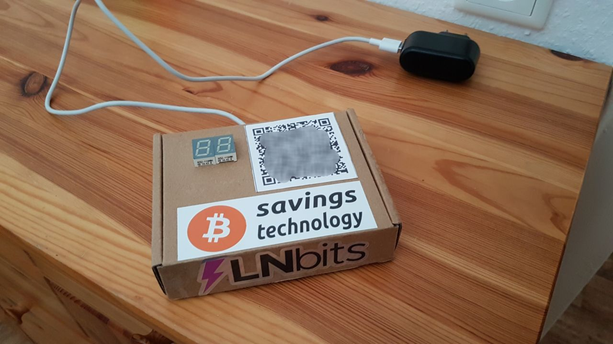
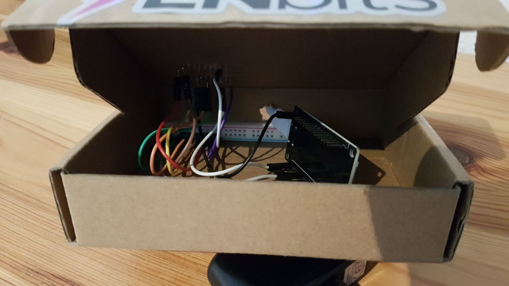

# 21 BitcoinSwitch showpiece
 A simple seven segment display that displays the number 21 after a lightning payment.

 This project has no use other than to showcase the simplicity of a BitcoinSwitch on meetups.

</img>
</img>

## Requirements:
- <a href="https://github.com/lnbits/bitcoinswitch">BitcoinSwitch repo</a>
- <a href="https://lnbits.github.io/bitcoinswitch/installer/">BitcoinSwitch Installer</a> & <a href="https://legend.lnbits.com">Lnbis</a>(ideally selfhosted)
- ESP-32 controller (+USB cable)
- 2x seven segment displays
- Some wires and a box
- Soldering iron (Not nessarily required)

## Notes
I did link the ESP32 to my hotspot to make it mobile.

You connect all required pins of your seven segment display to your selected pin of your ESP-32(following Ben's tutorial it's Pin 27).

</img>

"com" is GND. 
To display the number 2 you need to connect a, b, g, e, d 
To display the number 1 you need to connect b, c  